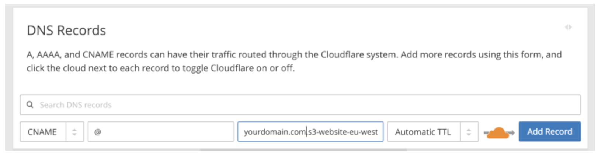

# Nuxt SSR 정적 버킷에 배포

## Nuxt 설치

Nuxt 공식 문서: [https://nuxtjs.org/docs/2.x/get-started/installation](https://nuxtjs.org/docs/2.x/get-started/installation)

npx 를 사용한 설치법 (제일 쉬움)

`npx create-nuxt-app <project-name>` 실행 후 몇가지 설정

1. 프로젝트 이름 설정
2. JS / TS 설정
3. yarn / npm 설정
4. UI framework 설정

    

5. Nuxt.js modules (Axios, Prograssive Wep App (PWA), Content)
6. Linting tools

    

7. 테스팅 프레임워크
8. 유니버셜 (SSR / SSG) / SPA
9. 배포 타겟: Node.js 서버 / Static hosting → 어떤 식으로든 S3 배포 가능
10. 개발도구
11. Version Control (Git)

이후 `cd <project-name>` 후 `npm run dev` 로 개발환경 실행 (Hot Reload 지원)

vue-cli 를 통한 확장

```bash
npm install -g @vue/cli #vue-cli 설치
npm install -g @vue/cli-init
vue init nuxt-community/start-template <project-name>
cd <project-name>
npm install
npm run dev
```

## 자동 라우팅

기존의 vue 에서 제공하던 vue-router 를 사용할 필요 없이 Nuxt.js 는 디렉토리 구조를 통해 자동으로 라우터를 설정해줌. 


그 후 필요한 .vue 폴더에서 다음과 같이 이동할 수 있음

```jsx
<template>
  <NuxtLink to="/">Home page</NuxtLink>
</template>
```

## SEO 개선을 위한 페이지별 Header 삽입

원문: [https://nuxtjs.org/docs/2.x/features/meta-tags-seo](https://nuxtjs.org/docs/2.x/features/meta-tags-seo)

Nuxt.js 는 3가지 방법으로 어플리케이션에 메타데이터를 제공합니다.

1. nuxt.config.js 를 전역으로 사용함
2. 지역적으로 오브젝트로 선언된 head 를 사용함
3. 지역적으로 computed 변수를 사용한 함수로 선언된 head 를 사용함

**전역 설정**

nuxt.config.js 에서 head 구성요소인 <meta> 태그를 정의할 수 있습니다. SEO를 개선시킬 수 있도록 정의된 제목과 설명을 기본값으로 제공합니다.


**지역 설정**

모든 vue 페이지의 <script> 태그안에 해당 페이지를 위한 head 객체를 선언하고 meta 구성요소를 추가할 수 있습니다. computed 변수로 head를 정의할 수도 있습니다.


같은 방식으로 head 의 script 와 link 구성요소를 통해 외부링크 리소스를 추가할 수도 있습니다.

## Nuxt 앱 AWS S3 에 5분만에 올리기 (실환경)

원문: [https://www.freecodecamp.org/news/deploy-a-nuxt-app-to-s3-in-5-minutes-515a161eb74f/](https://www.freecodecamp.org/news/deploy-a-nuxt-app-to-s3-in-5-minutes-515a161eb74f/)

시작하기 위해서 Nuxt, Vue.js 그리고 AWS S3 에 대한 사전지식이 필요합니다.

1. Vue CLI 설치하기
2. Nuxt app 만들기

    1, 2번 과정은 위에서 이미 언급했음으로 생략

3. 개발환경 테스트하기

    `npm install` 을 실행 한 후, `npm run dev` 를 실행하세요.

    그 후 [http://localhost:3000](http://localhost:3000) 에 접속하면 기본 Nuxt 홈페이지를 볼 수 있습니다.

4. Nuxt 앱 Generate 하기 & 정적 페이지를 위한 config 설정

    Nuxt 앱을 Generate 하면 node.js 서버가 아닌 dist 폴더의 정적 리소스로 웹서비스를 할 수 있도록 nuxt.config.js 를 다음과 같이 수정합니다.

    ```jsx
    export default {
    ...
    	target: 'static',
    ...
    } 
    ```

    `npm run generate` 를 실행하고나면 `/dist` 폴더안에 Nuxt 앱의 배포버전이 생성된 것을 확인할 수 있습니다. 이 폴더를 추후 S3에 업로드 하도록 하겠습니다.

5. AWS CLI 설치하기
6. AWS CLI 설정하기

    5, 6 과정 생략

7. S3 버킷 생성하기

    ```bash
    aws s3api create-bucket --bucket yourdomain.com --region eu-west-1 --create-bucket-configuration LocationConstraint=eu-west-1
    ```

    도메인과 리전을 상황에 맞게 변경하여 버킷을 생성할 수 있습니다.

8. S3 버킷을 정적 웹 호스팅이 가능하도록 변경

    ```bash
    aws s3 website s3://yourdomain.com/ --index-document index.html --error-document index.html
    ```

    `--index-document` 와 `--error-document` 를 설정하여 추후 커스터마이징 가능합니다.

9. S3 버킷 versioning 활성화

    ```bash
    aws s3api put-bucket-versioning --bucket yourdomain.com --versioning-configuration Status=Enabled
    ```

10. S3 버킷의 정책 생성

    IAM 으로 설정가능 → 생략

11. Nuxt app S3에 배포하기

    ```bash
    aws s3 cp dist s3://yourdomain.com --recursive
    ```

    `/dist` 폴더를 방금 만든 S3 버킷에다 업로드 합니다.

12. 특정 URL을 새로 올린 app으로 연결

    S3 버킷에 설정한 URL을 복사합니다.

    DNS 레코드에서 루트 CNAME 레코드와 버킷의 엔드포인트를 연결시켜 줍니다. DNS 서비스로 Cloudflare 를 사용한다면 다음과 같이 연동시킬 수 있습니다.

    

    주의: 이미 연동된 DNS A 레코드가 존재한다면, 삭제하고 시도해야 할 수도 있습니다.

**AWS S3 → GCP storage 마이그레이션**

⚠️ Storage 에서 제공하는 자체 라우팅이 Nuxt 라우팅과 혼선되어 라우트 사용이 어려울 수 있음.

원문: [https://cloud.google.com/storage/docs/hosting-static-website/?hl=ko](https://cloud.google.com/storage/docs/hosting-static-website/?hl=ko)

위의 1~4번까지의 과정은 동일합니다. (특히 변경사항을 항상 generate 해서 올려야 한다는 점)

1. 버킷 만들기
    - GCP 메뉴 > storage > 버킷 만들기
    - 데이터 저장위치 선택 (단일 리전일때 asia-northeast3 (서울))

        (버킷 위치에 대한 문서: [https://cloud.google.com/storage/docs/locations/?hl=ko](https://cloud.google.com/storage/docs/locations/?hl=ko))

    - 데이터 스토리지 선택: standard
    - 객체 액세스 제어 선택: 균일한 액세스 제어 (ACL 사용안함)

2. 사이트 파일 업로드

    ```bash
    gsutil ls
    	gs://<bucket-name> #버킷 리스트 반환

    gsutil rsync -R ./dist gs://<bucket-name>
    ```

3. 파일 공유 설정

    공개 인터넷의 모든 사용자가 버킷의 모든 객체를 읽을 수 있도록 설정

    ```bash
    gsutil iam ch allUsers:objectViewer gs://<bucket-name>
    ```

4. 특수 페이지 할당

    최상위 사이트에 액세스시 Landing page 결정

    ```bash
    gsutil web set -m index.html -e 404.html gs://<bucket-name> # -e는 선택사항. 없을 시 에러메세지 그대로 노출
    gsutil web get gs://<bucket-name> #설정된 사항 확인시
    ```

5. 로드벨런서 (부하 분산기) 및 SSL 인증서 설정

    GCP 메뉴 > 네트워크 서비스 > 부하 분산 > 부하 분산기 만들기

    HTTP(S) 부하 분산 구성 시작 > 인터넷 트래픽을 VM으로 분산

    1. 백엔드 구성

        백엔드 버킷 > 백엔드 버킷 만들기

        이름을 정한 후, 위에서 생성한 Cloud Storage 버킷을 찾아서 연결

    2. 호스트 규칙 및 경로 일치자 구성

        변경사항 없음

    3. 프런트엔드 구성

        이름 설정은 선택사항

        프로토콜 설정 HTTP or HTTPS

        IP 주소 > IP 주소 만들기 > 이름 정한 후 예약

        생성 후 부하분산 대시보드에서 리전이 전역으로 설정되었는지 확인 및 IP 주소 복사

6. 로드벨런서에 도메인 연결

    GCP 메뉴 > 네트워크 서비스 > Cloud DNS

    연결하고자 하는 DNS 영역의 영역이름 클릭

    레코드 세트 추가 버튼

    DNS 이름 설정, 5번에서 부하분산기에 할당된 IP 주소를 붙여넣기

7. 연결 테스트

    할당한 DNS 이름으로 브라우저에서 접속

## Nuxt 앱 로컬 개발환경 (로컬)

(선택사항) 배포시 정적 웹을 배포하는 것을 고려하여 미리 nuxt.config.json 의 target 을 설정할 수 있음 (실환경 1-4번 참고)

```jsx
npm run dev
```

위 명령어를 실행하면 `[localhost:3000](http://localhost:3000)` 에서 Rendering 된 화면을 볼 수 있음.

다른 포트번호로 로컬 및 로컬 Docker 에서 앱을 구성하기 원한다면, nuxt config 의 target 을 지우고 (target: 'server' 이 default 로 설정됨) server 설정을 포함시켜줄 수 있음

```jsx
export default {
...
	//target: 'server', target 설정하지 않을 시 이 설정이 기본으로 적용됨
	server: {
		host: 127.0.0.1 //로컬에서 Dockerize 할 시 0.0.0.0 으로 변경
		port: 3000
	}
...
} 
```

## Nuxt 앱 Dockerize → Skaffold → k8s (개별 QA)

개발환경 서버가 1대이고 develop branch로 구성되어 있기 때문에 한번에 하나의 QA 세션이 진행될 수 있고, 변경사항을 적용하기 위해 로컬 → develop 으로 다시 merge 하고 build 해야 되는 어려움이 있는데, 이를 k8s + skaffold 를 적용하여 본인의 로컬환경을 바로 서버에 올려서 보여줌으로써 QA 세션의 다변화와 변경사항을 즉시 반영할 수 있는 환경을 구성할 수 있음.

(요구사항) 실환경 1~3번, 4번의 nuxt config 구성이 모두 진행된 상태

- 구성 목표
    1. nginx revers proxy 서버로 nuxt static SSR 서버에 proxy_pass 로 연결해주는 컨테이너를 구성
    2. skaffold 로 위 컨테이너를 k8s 의 pod 로 연결하고 service와 ingress 를 관리하여 리소스를 제어함
1. Skaffold 설치 (Mac OS 기준)

    skaffold: [https://skaffold.dev/](https://skaffold.dev/)

    ```bash
    brew install skaffold
    ```

2. nginx.conf 작성

    [https://nuxtjs.org/faq/nginx-proxy/](https://nuxtjs.org/faq/nginx-proxy/)

    server root 만 추가

    ```
    server{
    ...
    	server_name <server_name>
    	root /var/www/html;
    ...
    }
    ```

3. Dockerfile 작성

    node alpine 이미지를 기반으로 nginx 를 구성하기 위해 프로세스 관리도구 supervisor 를 사용

    ```docker
    FROM node:alpine
    WORKDIR /var/www/html
    RUN apk update && \
            apk add nginx supervisor && \
            mkdir -p /run/nginx
    COPY ./nginx/nginx.conf /etc/nginx/conf.d/default.conf
    COPY ./supervisord.conf /etc/supervisor/conf.d/supervisord.conf
    COPY . .
    EXPOSE 80
    ENTRYPOINT ["./bootstrap.sh"]
    ```

    ENTRYPOINT 의 `[bootstrap.sh](http://bootstrap.sh)` 는 다음과 같이 구성

    ```bash
    #!/bin/sh
    npm install && npm run generate
    exec /usr/bin/supervisord -n -c /etc/supervisor/conf.d/supervisord.conf
    ```

4. supervisord.conf 작성 (nginx, npm 프로세스 관리)

    ```yaml
    [supervisord]
    logfile=/dev/null             ; (main log file;default $CWD/supervisord.log)
    logfile_maxbytes=0            ; (max main logfile bytes b4 rotation;default 50MB)
    logfile_backups=0             ; (num of main logfile rotation backups;default 10)
    loglevel=info                 ; (log level;default info; others: debug,warn,trace)
    pidfile=/tmp/supervisord.pid  ; (supervisord pidfile;default supervisord.pid)
    nodaemon=true                 ; (start in foreground if true;default false)

    [program:nginx]
    command=nginx -g 'daemon off;'
    stdout_logfile=/dev/stdout
    stdout_logfile_maxbytes=0
    stderr_logfile=/dev/stderr
    stderr_logfile_maxbytes=0
    autorestart=true
    priority=1

    [program:npm]
    command=npm start
    directory=/var/www/html
    stdout_logfile=/dev/stdout
    stdout_logfile_maxbytes=0
    stderr_logfile=/dev/stderr
    stderr_logfile_maxbytes=0
    autorestart=true
    priority=2
    ```

5. k8s.yaml 작성

    Service, Deployment, Ingress 구성

    

    Pod - Service - Ingress 사이의 관계 (위)

    Deployment 가 Pod 배포시 요청이 일어나는 프로세스 (아래)

    

    k8s.yaml 구성요소 (파일 이름은 상황에 따라 k8s-dev, k8s-sync 등으로 수정 가능)

    ```yaml
    # Service 선언 - service 는 네트워크 개념
    apiVersion: v1
    kind: Service
    metadata:
        name: nuxt-static-svc #서비스 이름은 namespace 내에서 유일해야 함
        namespace: sd
        labels:
            app: nuxt-test #app 이름은 service-deployment-ingress 에서 일정해야함
    spec:
        selector:
            app: nuxt-test
        ports:
            -   name: https
                port: 443
                protocol: TCP
                targetPort: 80
            -   name: http
                port: 80
                protocol: TCP
                targetPort: 80
        type: ClusterIP
    ---
    # Deployment 선언
    apiVersion: apps/v1
    kind: Deployment
    metadata:
        name: nuxt-test #app 이름 선언
        namespace: sd
        labels:
            app: nuxt-test
    spec:
        replicas: 1    # Number of replicas of back-end application to be deployed
        selector:
            matchLabels:
                app: nuxt-test
        template:
            metadata:
                labels: # Must macth 'Service' and 'Deployment' labels
                    app: nuxt-test
            spec:
                hostname: gke-nuxt-test
                containers:
                    -   name: nuxt-test
    					# imgage 는 gcp 내 <proj_id> 프로젝트의 container registry 안에서 nuxt-testapp 이라는 이름으로 묶임.
    					# 빌드시에 지금 image + 커밋해시 등으로 이미지가 올라가게되고, skaffold 로 빌드하는 경우 unique string 을 제공함(dirty).
                        image: gcr.io/<proj_id>/nuxt-testapp
                        ports:
                            -   containerPort: 80
                        readinessProbe:
                            httpGet:
                                path: /healthz # Health Check 로직, nginx 에서 위 url 을 설정한 후 200 응답을 받으면 pass 하도록 설정.
                                port: 80
                            initialDelaySeconds: 5
                            periodSeconds: 10
                        resources:
                            limits:
                                cpu: "2"
                                memory: 1024Mi
                            requests:
                                cpu: "500m"
                                memory: 1024Mi

    ---
    # Ingress 선언
    apiVersion: networking.k8s.io/v1beta1
    kind: Ingress
    metadata:
        name: nuxt-static-ingress
        namespace: sd
        annotations:
            kubernetes.io/ingress.class: "nginx"
            cert-manager.io/cluster-issuer: letsencrypt-prod
            nginx.ingress.kubernetes.io/rewrite-target: /
    spec:
        rules:
    					# GCP 네트워크 서비스 > Cloud DNS 에 와일드카드로 *.example.com 선언된 규칙을 따름.
            - host: nuxt-testapp.example.com
              http:
                  paths:
                      - backend:
                            serviceName: nuxt-static-svc #위에서 설정한 서비스명
                            servicePort: 80
                        path: /
        # SSL 설정
        tls:
          - hosts:
            - nuxt-testapp.example.com
            secretName: nuxt-testapp.example.com
    ```

6. `skaffold init` 을 이용한 skaffold.yaml 생성

    k8s.yaml 및 Dockerfile 이 존재하지 않으면 Skaffold init 시 에러가 생김.

    이미지와 menifest 파일 정보를 가져와서 skaffold.yaml 생성

7. `skaffold run` 실행 시 skaffold.yaml 정보를 따라 이미지를 빌드하고, k8s.yaml 정보를 따라 Service, Deployment, Ingress를 클러스터에 구성해주고 부족한 리소스는 자동으로 요청해서 서비스를 올림.
8. `skaffold stop` run 에 의해 실행되었던 해당 리소스들을 깨끗하게 정리해 줌.

## Nuxt + Axios, Bootstrap 모듈 추가하기

```bash
npm install @nuxtjs/axios --save
npm install bootstrap-vue --save
```

`nuxt.config.js` 파일에 다음을 추가

```jsx
...
// Modules (https://go.nuxtjs.dev/config-modules)
  modules: [
    '@nuxtjs/axios',
    'bootstrap-vue/nuxt'
  ],
...
```